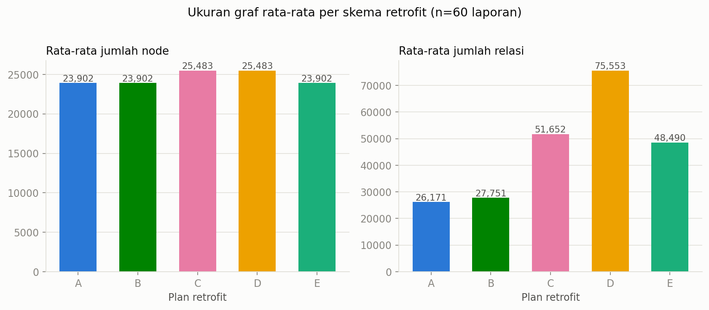
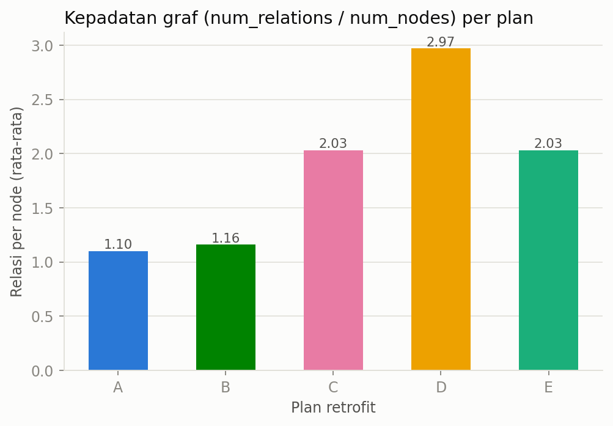
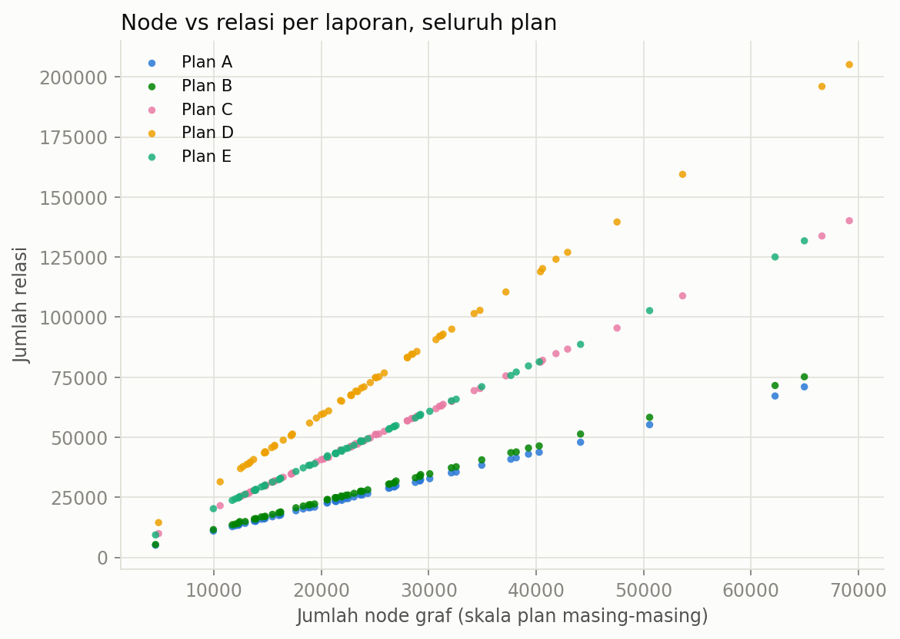
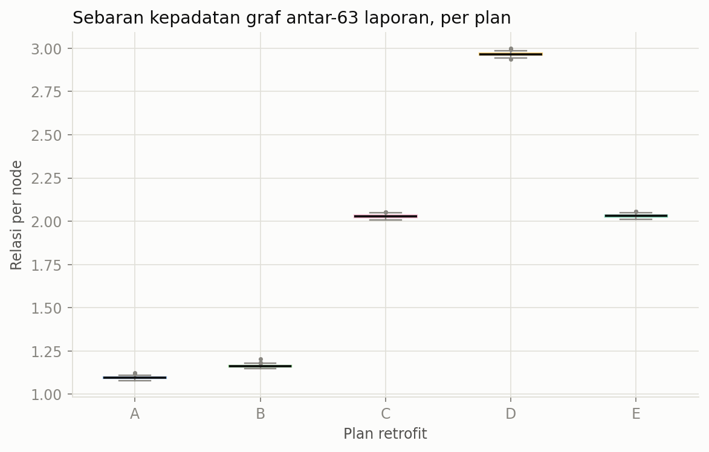
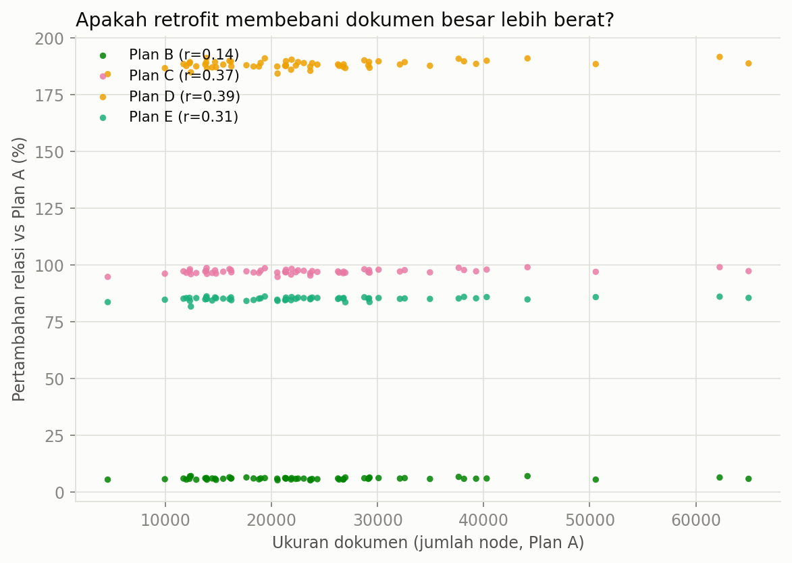

# Penjelasan Hasil Analisis Retrofit Plan A–E

File ini menjelaskan tiap grafik yang dihasilkan oleh
[`analyze_retrofit_plans.py`](../analyze_retrofit_plans.py), supaya lebih gampang
dipahami saat dipakai untuk slide presentasi.

## Konteks singkat

Ada 5 skema ("plan") yang menentukan bagaimana node `doc_cls` (representasi
dokumen) dihubungkan ke node-node kalimat AMR di dalam graf. Semua plan
dijalankan di 60 laporan (transkrip earnings call) yang sama, jadi
perbandingan antar-plan itu apple-to-apple.

| Plan | Cara menghubungkan | Nambah node? |
|---|---|---|
| **A** | `doc_cls` <-> root kalimat sebelumnya saja (baseline, paling jarang) | Tidak |
| **B** | A + rantai `root(sblm) <-> root(skrg)` | Tidak |
| **C** | Tambah node virtual `snt_cls` per kalimat, `snt_cls` <-> semua node kalimat sebelumnya + `doc_cls`, plus rantai `snt_cls` antar-kalimat | Ya (+`snt_cls`) |
| **D** | Sama seperti C, **plus** `doc_cls` disambungkan langsung ke *setiap* node individual di kalimat sebelumnya | Ya (+`snt_cls`) |
| **E** | Tanpa `snt_cls`, `doc_cls` langsung ke *setiap* node individual di kalimat sebelumnya | Tidak |

Angka acuan (rata-rata dari 60 file, lihat [`summary_per_plan.csv`](summary_per_plan.csv)):

| Plan | Rata² node | Rata² relasi | Densitas (relasi/node) |
|---|---|---|---|
| A | 23,902 | 26,171 | 1.10 |
| B | 23,902 | 27,751 | 1.16 |
| C | 25,483 | 51,652 | 2.03 |
| D | 25,483 | 75,553 | 2.97 |
| E | 23,902 | 48,490 | 2.03 |

---

## `fig1_avg_nodes_relations.png`

**Apa yang ditampilkan:** dua bar chart berdampingan — panel kiri rata-rata
**jumlah node** per plan, panel kanan rata-rata **jumlah relasi** per plan.
Sengaja dipisah jadi dua panel (bukan satu chart dua sumbu) karena skalanya
beda jauh (puluhan ribu node vs puluhan ribu-ratusan ribu relasi).

**Cara membaca:** bandingkan tinggi bar antar-plan di tiap panel secara
terpisah. Panel kiri menunjukkan plan mana yang menambah *node* baru (hanya
C & D, karena node `snt_cls`). Panel kanan menunjukkan plan mana yang
menambah *relasi* paling banyak.

**Insight kunci:** jumlah node nyaris tidak berubah antar-plan (cuma naik
~6.6% di C/D karena node `snt_cls`), tapi jumlah relasi melonjak drastis —
dari ~26 ribu (A) sampai ~76 ribu (D), hampir 3x lipat. Ini bukti bahwa
perbedaan utama antar-plan ada di **struktur/kepadatan koneksi**, bukan di
ukuran graf itu sendiri.

---

## `fig2_avg_density.png`

**Apa yang ditampilkan:** bar chart tunggal, rata-rata **densitas graf**
(`num_relations / num_nodes`) per plan — yaitu rata-rata berapa banyak relasi
"dimiliki" oleh satu node.

**Cara membaca:** semakin tinggi bar, semakin padat/kaya koneksi graf
tersebut secara rata-rata per node. Ini metrik yang menormalkan pengaruh
ukuran graf, jadi murni membandingkan "kekayaan struktural" antar-plan.

**Insight kunci:** urutan densitas dari rendah ke tinggi adalah
A (1.10) < B (1.16) < C ≈ E (2.03) < D (2.97). Plan D paling padat (hampir
3 relasi per node), sedangkan A paling jarang. Untuk presentasi, ini angka
paling ringkas untuk bilang "Plan D menghasilkan graf ~2.7x lebih padat
dibanding baseline A".

---

## `fig3_nodes_vs_relations_scatter.png`

**Apa yang ditampilkan:** scatter plot dengan sumbu-X = jumlah node dan
sumbu-Y = jumlah relasi, **satu titik per laporan per plan** (5 warna =
5 plan). Tiap titik mewakili satu file `.pt` (satu perusahaan-tahun).

**Cara membaca:** perhatikan **kemiringan (slope)** kelompok titik tiap
warna, bukan posisi individual titik. Slope yang lebih curam = pertambahan
relasi per node tambahan lebih besar (lebih padat). Titik-titik yang
menyebar ke kanan adalah laporan dengan dokumen lebih panjang (lebih banyak
kalimat/token).

**Insight kunci:** kelima plan membentuk garis lurus yang rapi (hampir tidak
ada noise/outlier di luar garis) — artinya hubungan node↔relasi di tiap plan
sangat konsisten (linear) untuk semua ukuran dokumen, kecil maupun besar.
Urutan kemiringan dari paling landai ke paling curam: A ≈ B (paling landai,
saling berhimpit) < E ≈ C < D (paling curam). Plan D dan Plan E/C terlihat
jelas terpisah dari kelompok A/B, mengonfirmasi lompatan densitas yang sama
seperti di `fig2`.

---

## `fig4_density_boxplot.png`

**Apa yang ditampilkan:** box plot sebaran densitas (relasi/node) untuk
seluruh 60 laporan, per plan. Kotak = rentang interkuartil (25%–75%), garis
tengah = median, whisker = rentang sebaran, titik = outlier.

**Cara membaca:** semakin pendek/rapat kotaknya, semakin **konsisten**
densitas plan tersebut di semua perusahaan (tidak terlalu dipengaruhi
panjang/pendeknya transkrip). Posisi vertikal kotak menunjukkan level
densitas rata-rata (sama seperti `fig2`, tapi di sini terlihat variasinya).

**Insight kunci:** semua plan punya kotak yang **sangat sempit** (variasi
kecil, std density cuma ~0.01) — artinya densitas tiap plan itu stabil dan
dapat diprediksi, tidak peduli perusahaan apa/tahun berapa. Ini penting untuk
argumen bahwa perbedaan antar-plan murni soal *desain skema retrofit*, bukan
kebetulan karakteristik data tertentu.

---

## `fig5_growth_vs_doc_size.png`

**Apa yang ditampilkan:** scatter plot dengan sumbu-X = ukuran dokumen
(jumlah node di Plan A, sebagai proxy panjang transkrip) dan sumbu-Y =
**persentase pertambahan relasi** dibanding Plan A, untuk Plan B/C/D/E.
Angka `r=` di legenda adalah koefisien korelasi Pearson antara ukuran
dokumen dan persentase pertambahan tersebut.

**Cara membaca:** kalau titik-titik satu warna membentuk **pita horizontal
rata** (tidak naik/turun seiring sumbu-X), berarti persentase overhead plan
itu **konstan**, tidak peduli dokumen pendek atau panjang. Kalau pita miring
naik, berarti dokumen besar "dihukum" lebih berat oleh retrofit tersebut
(berisiko untuk training GNN pada dokumen besar).

**Insight kunci:** ini grafik paling penting untuk argumen skalabilitas.
Semua pita (B, C, D, E) relatif horizontal dan korelasinya lemah
(r = 0.14–0.39, jauh dari 1.0) — artinya **pertambahan relasi bersifat
proporsional/konstan secara persentase**, terlepas dari perusahaan itu
laporan kecil (~5 ribu node) atau raksasa (ADHI_2024, ~65 ribu node). Jadi
tidak ada indikasi bahwa retrofit ini "meledak" secara tidak proporsional
di dokumen panjang — aman dipakai untuk semua ukuran earnings call di
dataset ini.

---

## Rekap satu-kalimat per plan (siap tempel di slide)

- **Plan A** — baseline paling ringan (1.10 relasi/node), cocok untuk
  eksperimen cepat/hemat memori.
- **Plan B** — sedikit lebih padat dari A (+6% relasi) tanpa biaya tambahan
  berarti; hampir tidak berbeda dari baseline.
- **Plan C** — melipatgandakan relasi hampir 2x (+97%) dengan menambah node
  virtual `snt_cls`; menyeimbangkan kekayaan struktur vs biaya node.
  Kembar-densitas dengan **E**.
  Kembar-jumlah-node dengan **D**.
- **Plan D** — paling padat & paling mahal (+189% relasi, densitas 2.97);
  cocok kalau prioritasnya ekspresivitas graf maksimal dan resource
  training tidak jadi kendala.
- **Plan E** — mencapai densitas setara C (+85% relasi) **tanpa** menambah
  node sama sekali → kandidat paling efisien memori-vs-kekayaan-relasi.
- **Semua plan** menskalakan relasinya secara proporsional terhadap panjang
  dokumen (lihat `fig5`) — jadi pemilihan plan bisa murni berdasarkan
  trade-off ekspresivitas vs biaya komputasi, bukan risiko dokumen tertentu
  meledak ukurannya.
